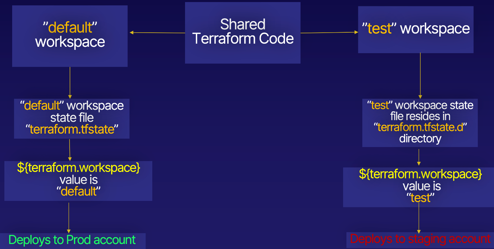

# Terraform workspace

delete  -- Delete a workspace
list    -- List Workspaces
new     -- Create a new workspace
select  -- Select a workspace
show    -- Show the name of the current workspace

## The main.tf file contains provider and EC2 VM resources
## and uses ${terraform.workspace} variable and logic to decide what 
## region to deploy in

The network.tf file spins up the network resources required by  
the EC2 VM and uses ${terraform.workspace} variable to set their Names/IDs.

## Diagram:
